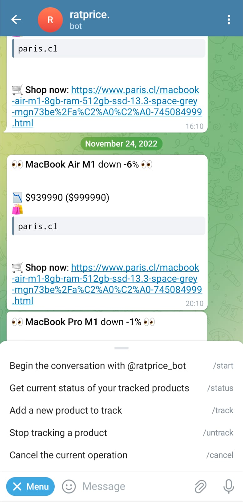

# 🐭 ratprice.

Track prices from your favorite products of the biggest online retail shops in Chile through a Telegram Bot.



## Setup

### Requirements

- Python 3.9.6
- `libxml2` and `libxslt`

### Installation & development

#### Local

1. Clone the repository
2. Create a python virtual environment and install

```bash
python -m venv venv
source venv/bin/activate
pip install -r requirements.txt
```

3. Run with `python price_engine/run.py`
